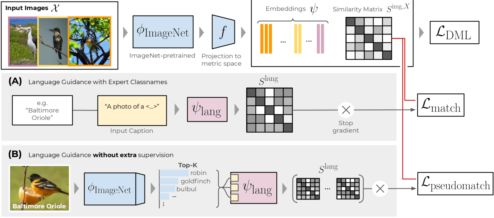

# Language Guidance for Vision-based Deep Metric Learning
#### ___Contact___: Karsten Roth (karsten.rh1@gmail.com)

---
#### Table of Contents:
   * [Introduction](#usage)
   * [Requirements](#requirements)
   * [Quick Guide](#guide)  
   * [Repository & Dataset structures](#repo) 
   * [Citation](#citation)   

---
## Introduction


This repository contains the official code for our CVPR 2022 paper on [Integrating Language Guidance into Vision-based Deep Metric Learning](#placeholder).
The goal of the proposed approach is to counteract the high degree of performance saturation in vision-based Deep Metric Learning by incorporating the use of language-based pretraining without the need of additional supervision.

In particular, as Deep Metric Learning pipelines heavily rely on ImageNet pretraining,
we showcase that the resulting access to pseudolabelling allows for the integration of language semantics into the learning process of visual representations and in turn significant improvements in performance.

_Note:_ This repository is build on top of preceding work [here](https://github.com/Confusezius/Revisiting_Deep_Metric_Learning_PyTorch).

---
## Requirements
This repository has been built and tested around `Python 3.8` and `PyTorch 1.9+`. The required libraries and their installation process can be found in `requirements.sh`.

For example, one can create a simple conda environment via
```
wget  https://repo.continuum.io/miniconda/Miniconda3-latest-Linux-x86_64.sh
bash Miniconda3-latest-Linux-x86_64.sh # say yes to append path to bashrc.
source .bashrc
conda create -n Env python=3.8
conda activate Env
```

and then install the required libraries following `requirements.sh`.


---
## Quick Guide

### Rerunning baselines and language-guided variants.
The required setup for each benchmark dataset is explained in the subsequent sections. In general, datasets can be downloaded e.g. from
* [CUB200-2011](http://www.vision.caltech.edu/visipedia/CUB-200.html)
* [CARS196](https://ai.stanford.edu/~jkrause/cars/car_dataset.html)
* [Stanford Online Products](http://cvgl.stanford.edu/projects/lifted_struct/)


The main training script is `main.py`, with an exemplary call given here:

```
python main.py --seed 2 --log_online --group cub200-rn128_msim_baseline --no_train_metrics --project LanguageGuidance --gpu $gpu --source_path $datapath \
--dataset cub200 --n_epochs 100 --tau 100 --gamma 1 --arch resnet50_frozen_normalize --embed_dim 128 --loss multisimilarity --bs 90
```

This run trains a 128-dimensional (--embed_dim) metric space spanned over ResNet50 features with normalized embeddings and frozen BatchNorm (given via `--arch`) using a multisimilarity loss ('--loss') for 100 epochs (`--epochs`), no learning rate scheduling (`--tau`, `--gamma`) and without logging metrics on the training data (`--no_train_metrics`).
The training metrics are logged to a [Weights & Biases](https://wandb.ai/) project (`--log_online`, `--project`), with the particular run name given via `--group`. This ensures that changes in `--seed` are assigned to the same overall group.

For further details and additional parameters, please check out `parameters.py`, which contains all available parameters separated by the general purpose and some additional explanation.

To now add __language guidance__ to a DML method, simply set `--language_distill_w` to a value bigger `0`, and append `--language_pseudoclass` to utilize pseudolabels extracted from the available ImageNet pretraining.

This gives:

```
python main.py --seed 2 --log_online --group cub200-rn128_msim_pseudolang --no_train_metrics --project LanguageGuidance --gpu $gpu --source_path $datapath \
--dataset cub200 --n_epochs 100 --tau 100 --gamma 1 --arch resnet50_frozen_normalize --embed_dim 128 --loss multisimilarity --bs 90 \
--language_distill_w 7.5 --language_pseudoclass
```

For further language guidance hyperparameters, check out `parameters.py > language_guidance_parameters()`.

Finally, various replication runs on the two primary benchmarks where Language Guidance shows significant benefits, CUB200-2011 and CARS196, are given in `language_guidance_benchmark_runs.sh`, alongside some suggestions for an initial learning rate scheduling step determined via initial validation runs.
As usual, with changes in software versioning and hardware, convergence may slightly differ, so the scheduling parameters need some adaptation to the local setup.


---
## Repository Structure & Expected Dataset Structures.

### Repository
The repository has the following structure:

```
Repository
|
│   README.md # Base Readme.
│   requirements.sh # List of required libraries.
│   language_guidance_benchmark_runs.sh # Sample benchmark runs.
|   main.py # main training script)
|   parameters.py # collection of pipeline and training parameters.
│   
└───criteria # available baseline objectives
|    │   e.g. margin.py
│   
└───batchminer # available batchmining heuristics
|    │   e.g. distance.py
│   
└───datasampler # methods to construct minibatches.
|    │   e.g. class_random_sampler.py
│   
└───metrics # Folder of standard DML evaluation metrics.
|    │   e.g. mAP.py
│   
└───evaluation # Main evaluation protocols.
|    │   Only __init__.py
│   
└───datasets # Main DML benchmarks.
|    │   e.g. cub200.py
│   
└───utilities # Some utility and misc. functions.
|    │   e.g. logger.py
|
└───Training_Results (will be generated during Training)
|    │   contains folders based on dataset names, e.g. cub200. These folders then contain each run.
```

### Dataset Structures
The benchmarks are expected to follow these setups in order to be directly usable with the provided dataloaders, and path to the respective parent folder should be passed to the main training script via `--datapath <path_to_parent_folder>`. The dataset folder name is passed via `--dataset <dataset_name>`.

__cub200__
```
cub200
└───images
|    └───001.Black_footed_Albatross
|           │   Black_Footed_Albatross_0001_796111
|           │   ...
|    ...
```

__cars196__
```
cars196
└───images
|    └───Acura Integra Type R 2001
|           │   00128.jpg
|           │   ...
|    ...
```

__online_products__
```
online_products
└───images
|    └───bicycle_final
|           │   111085122871_0.jpg
|    ...
|
└───Info_Files
|    │   bicycle.txt
|    │   ...
```


---
## Citation
If you use this code or parts of it for you work, please cite
```
TBA

```
